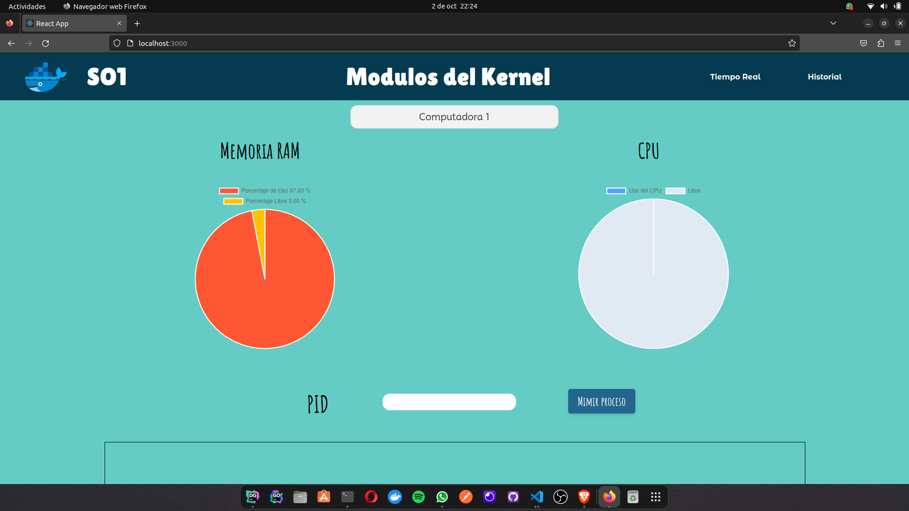
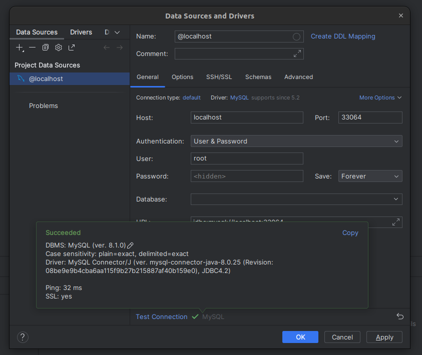
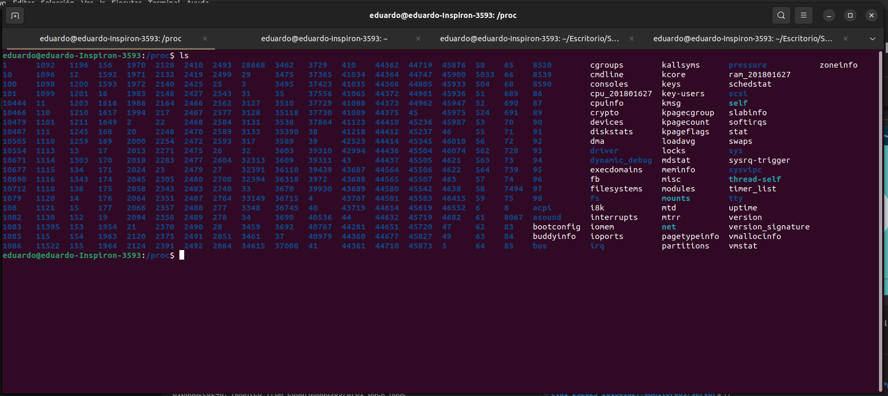

# Manual Técnico - Proyecto 1 Sistemas Operativos 1

[Web UI](#web)

[DataBase](#bd)

[Service Kill](#pid)

[Modules](#rc)

[GCP](#cloud)

[Docker](#conteiner)

## Web UI <a id="web"></a>



**Esta es la pagina princial donde podremos ver la interfaz del usuario, con la cual podra interactuar para poder ver los estados de las computadoras**

## Database <a id="bd"></a>
**Para crear nuestra instancia para la base de datos debemos de correr el siguiente comando**

`sudo docker run -d -p PUERTO_SALIDA_CONTENEDOR:3306 --name NOMBRE_INSTACIA -e MYSQL_ROOT_PASSWORD=PASS_BD -v NOMBRE_CONTENEDOR:/var/lib/mysql mysql`

**Donde**

```
PUERTO_SALIDA_CONTENEDOR: será el puerto que tenga el contenedor para poder ser ecuchado desde las computadoras de GCP y no tenga conflicto con las demás bases de datos.

NOMBRE_INSTANCIA: Es el nombre que tendrá la instacia de la base de datos.

PASS_BD: Es la contraseña que le colocaremos a la base de datos.

NOMBRE_CONTENEDOR: Es el nombre que tendrá el contenedor de la base de datos, este nombre será importante para la creación de nuestro docker-compose.
```

**Ahora despues de haber creado nuestra instacia de la base de datos, posdemos usar MySQL Workbeanch o DataGrip para poder conectar y usarla**

```
PORT: Colocamos el puerto de salida del contenedor para poder conectarlo.

User: Colocamos el user root.

Password: Debemos de colocar la contraseña que se establecio cuando se creo la instancia.
```




## Modulos de Kernel <a id="rc"></a>



**Como podremos darnos cuenta dentro de la carpeta proc tenemos los modulos de ram y de cpu los cuales estan identificados por medio de mi carnet el cual es 201801627**