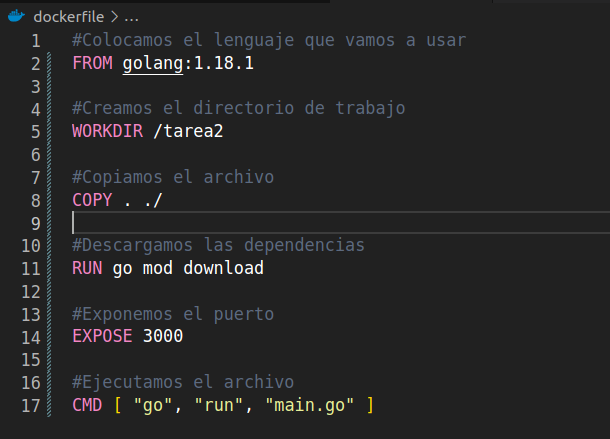
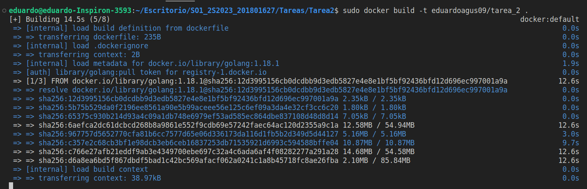
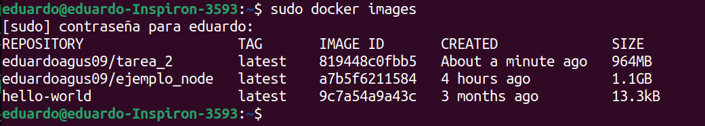
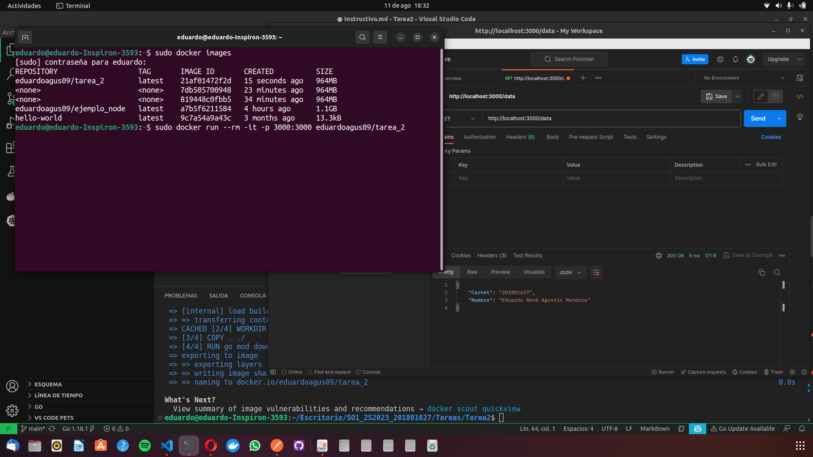

# Instructivo de Comandos

[Instalación de Herramientas](#installar)

[Comandos para Dockerizar una Imagen](#patito)

### Instalación de Go 

**Abrimos una terminal y corremos los sigueintes comandos**

`sudo apt update`

`sudo apt install golang`

`export GOPATH=$HOME/go`

`export PATH=$PATH:$GOPATH/bin`

 

**Para ver que versión tenemos instalada de Go corremos el sigueinte comando**

`go --version`

### Instalación de Docker

**Debemos de entrar a la [documentación](https://docs.docker.com/get-docker/) de docker y debemos de escoger nuestro sistema operativo, puesto que tendremos para instalar en MAC, Linux y Windows, en este caso nosotros escogeremos Linux. Para seguir paso a paso podemos ver el sigueinte [video](https://www.youtube.com/watch?v=Erl81eIFZnI) el cual nos ayudara un poco a como ir instalando lo necesario**

### Dockerizar la Aplicación  

**Dentro de nuestro proyecto creamos todos los archivos que necesitamos para el uso de la misma y creamos el docker file para poder crear la imagen de nuestro proyecto usando el siguiente comando**

`touch dockerfile`

**Tener en cuenta que debemos de tener también creado nuestro archivo go.mod, si no lo generamos con el sigueinte comando**

`go mod init ruta_de_donde_queremos_el_archivo`

**Este archivo es el que llevara todos los comandos para poder crearlo de la mejor manera en nuestro contenedor**

**Cuando tengamos ya realizado esto procedemos a generar la imagen usando el sigueinte comando**

`sudo docker build -t usuario_Dockerhub/nombre_contenedor`

**Donde en usuario debemos de colocar nuestro usiario de [docker hub](https://hub.docker.com) y en nombre contenedor debemos de colocar el nombre que le queremos dar a nuestro contenedor**

**Después de esto, abrimos una consola y ejecutamos el sigueinte comando**

`sudo docker images`

**Como podemos ver nos muestra nuestras imagenes que hemos creado, despues de eso corremos el comando de**

`sudo docker run --rm -it -p 3000:3000 usuario_dockerhub/nombre_contenedor`

**Tenemos que tener en cuenta que debemos de definir el puerto en el DockerFile y en el archivo de main.go o donde lo configuremos para que este se puede ejecutar, si todo está bien debería de hacer la acción en postman sin ningun problema, es este caso hacemos una petción get con los datos del estudiante**

**Al finalizar esto, lo podemos subir a nuestro repositorio sin ningun problema con docker push, para esto debemos de tener iniciada sesión en docker en nuestro VSCODE usando**

`sudo docker login`

**Ingresamos nuestras credenciales y luego haces el docker push**

`sudo docker push usuario_dockerhub/nombre_contendero`

